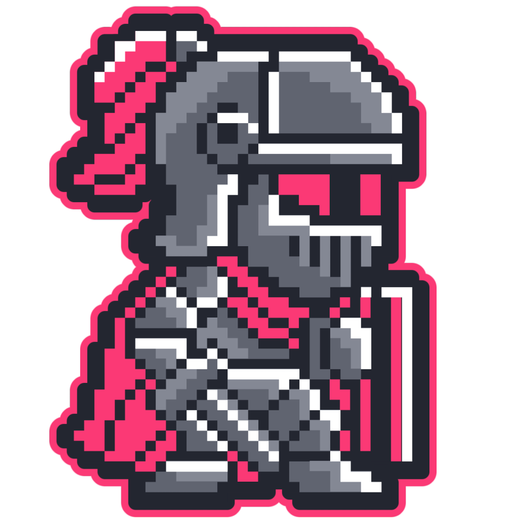
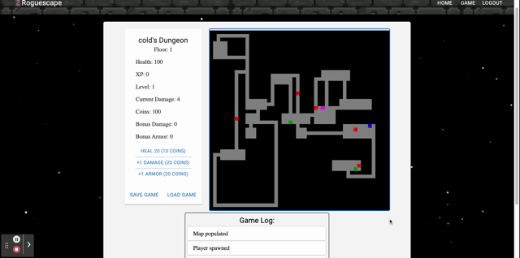
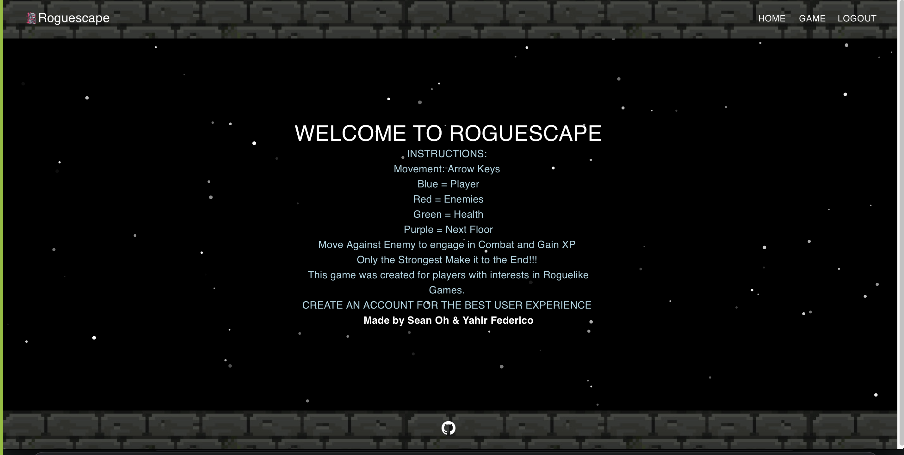
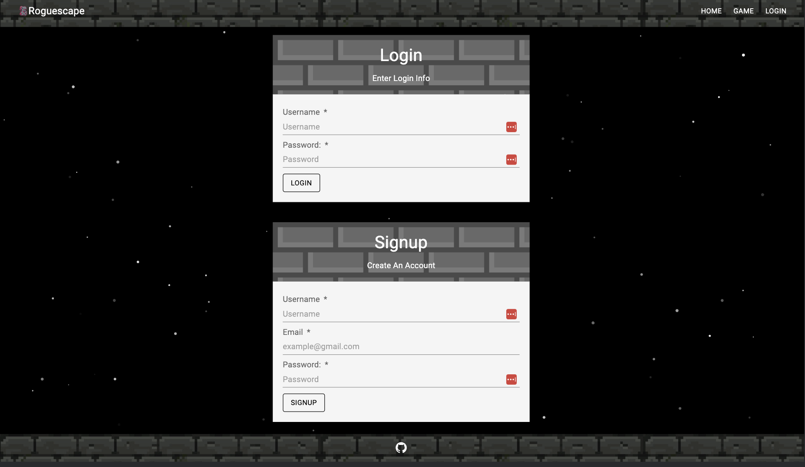

<h1 align ="center">Roguescape<h1>
<p align="center">
  
</p>
<h2 align ="center">A roguelike dungeon crawler game built with React, Redux, and Node.js<h2>
<h3 align ="center">Play the game <a href="https://roguescape.herokuapp.com/">here</a>!<h3>

<hr />

## Table of Contents

- [Description](#description)
- [Showcase](#showcase)
- [Installation](#installation)
- [Usage](#usage)
- [Features](#features)
- [Technologies](#technologies)
- [Snippets](#snippets)
- [License](#license)
- [Authors](#contributions)

## Description

A roguelike dungeon crawler game built with React, Redux, and Node.js. The game is a single-player game where the player must navigate through a dungeon and defeat monsters to reach the next floor. The game is built with a React frontend and a Node.js backend. The game is deployed on Heroku.

## Showcase

Gameplay:

<br />

Homepage:


<br />

Login page:


## Installation

- `git clone` this repository
- Run `npm install` to install all dependencies
- Run `npm run develop` to run the app locally
- Navigate to `localhost:3000` to play the game.
- Run `npm run build`, then `npm start` to generate a build version and run it on `localhost:3001`

## Usage

Navigate to the [deployed link](https://roguescape.herokuapp.com/) to play the game. Create an account on the login page and start playing. Use the arrow keys to move around the map. Defeat enemies to gain experience and level up. Enter the pink portal to go to the next floor. The game is over when the player dies.

## Features

- User authentication
- User can create an account and login
- User can move around the map
- User can attack enemies
- User can level up
- User can spend coins to increase stats
- User can go to the next floor
- User can see their stats
- User can save their progress
- User can load their progress

## Technologies

- [React](https://reactjs.org)
- [Redux](https://redux.js.org/) / [react-redux](https://react-redux.js.org)
- [MongoDB](https://www.mongodb.com/)
- [Mongoose](https://mongoosejs.com)
- [MaterialUi](https://mui.com)
- [rot-js](https://www.npmjs.com/package/rot-js)
- [Javascript](https://developer.mozilla.org/en-US/docs/Web/JavaScript) / [JSX](https://reactjs.org/docs/introducing-jsx.html)
- [Node.js](https://nodejs.org/)
- [Express](https://expressjs.com/)
- [JWT](https://www.npmjs.com/package/jsonwebtoken) / [JWT Decode](https://www.npmjs.com/package/jwt-decode)
- [bcrypt](https://www.npmjs.com/package/bcrypt)
- [tsParticles](https://particles.js.org)
- [lodash](https://lodash.com)
- [swipeable](https://www.npmjs.com/package/react-swipeable)
- [toastify](https://www.npmjs.com/package/react-toastify)

## Snippets

### Player Movement

<details>
  <summary><b>Expand Snippet</b></summary>

```javascript
// calculate damage and health values and update player/enemy values
// gain coins and xp based on floor level
case 'enemy': {
  const playerHealth = player.attributes.health;
  const playerDamage = player.attributes.damage + player.attributes.bonusDamage;
  const enemyHealth = newEntity.attributes.health;
  let enemyDamage = newEntity.attributes.damage - player.attributes.bonusArmor;
  if (enemyDamage < 0) { enemyDamage = 0; };
  dispatch({
    type: DAMAGE,
    payload: {
      entityName: newEntity.entityName,
      dmgValue: playerDamage
    }
  });
  addToLog(`Dealt ${playerDamage} damage to ${newEntity.entityName} (Current health: ${state.entities[newEntity.entityName].attributes.health})`);
  dispatch({
    type: DAMAGE,
    payload: {
      entityName: 'player',
      dmgValue: enemyDamage
    }
  });
  addToLog(`Recieved ${enemyDamage} damage from ${newEntity.entityName}`);
  // check if enemy lived
  if (enemyHealth > playerDamage) {
    // check if player died
    if (enemyDamage >= playerHealth) {
      toast.error("YOU DIED");
      reset();
      window.location.reload();
      return;
    }
  } else {
    dispatch({
      type: MOVE,
      payload: {
        entity: player,
        vector: vector
      }
    });
    dispatch({
      type: REMOVE_ENTITY,
      payload: { entityName: newEntity.entityName }
    });
    const baseXP = Math.floor((5 * (state.floor) ** 2 + 5));
    const xpVariance = Math.floor(Math.random() * (baseXP / 5) - (baseXP / 10));
    dispatch({
      type: GAIN_XP,
      payload: { value: baseXP + xpVariance }
    });
    addToLog(`Gained ${baseXP + xpVariance} XP`);
    dispatch({
      type: LEVEL_UP,
      payload: {
        stats: calculateStats,
        level: calculateLevel
      }
    });
    const baseCoins = Math.floor((2 * (state.floor) ** 1.5 + 5));
    const coinVariance = Math.floor(Math.random() * (baseCoins / 5) - (baseCoins / 10));
    dispatch({
      type: GAIN_COINS,
      payload: { coins: baseCoins + coinVariance }
    });
    addToLog(`Gained ${baseCoins + coinVariance} coins`);
  }
  break;
}

```

###

</details>

## License


This Project is licensed under the [MIT license](./LICENSE).

## Authors

| Yahir Federico                       | Sean Oh                              |
| ------------------------------------ | ------------------------------------ |
| [Github](https://github.com/Yahir-F) | [Github](https://github.com/seannoh) |
